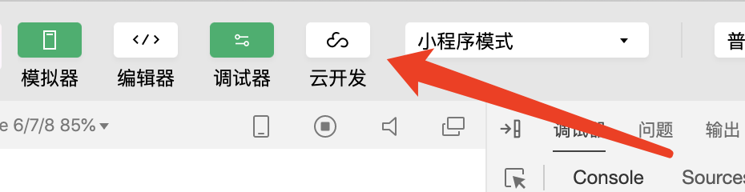
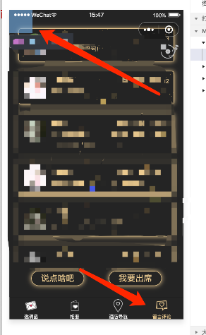
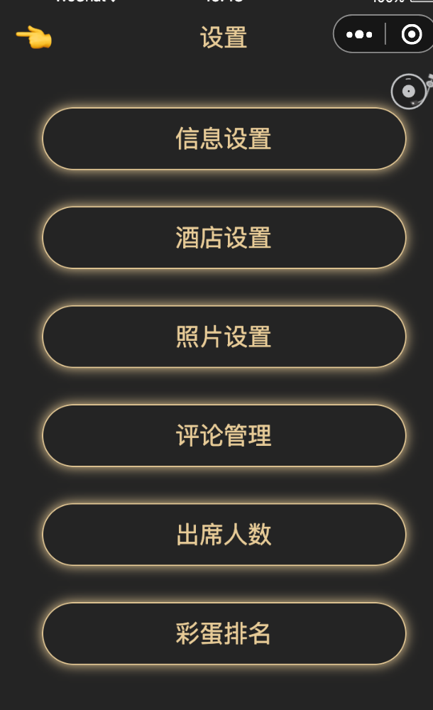
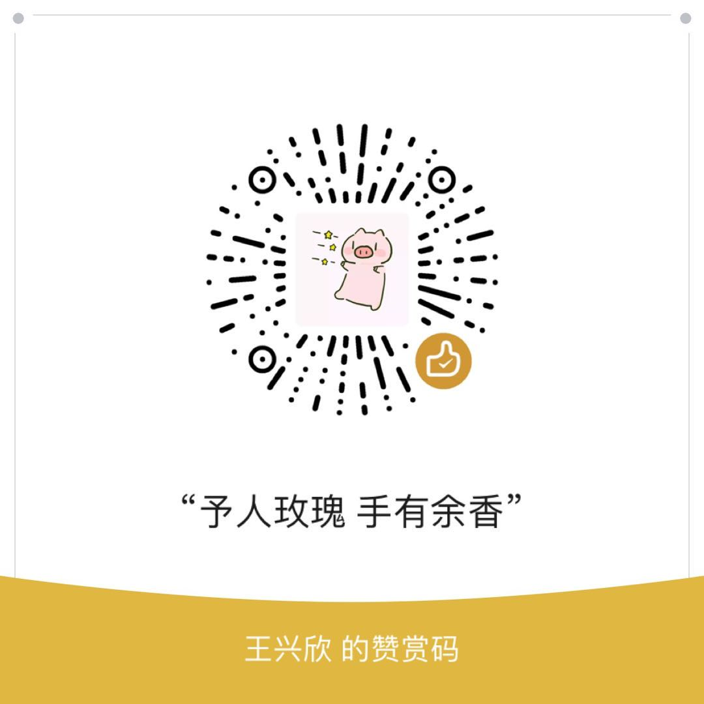

# marriage

### 简单、方便、基于云开发的婚礼请柬程序

**上手即用，无需自己创建数据库。**

**只需要在小程序内上传信息与照片等，到自己的云开发数据库即可。**

---

### 描小程序码预览小程序

### 简要介绍

主要包括6个模块

1. 邀请函
2. 相册
3. 酒店导航
4. 留言评论
5. 一个隐藏的彩蛋页面
6. 信息的录入、照片上传与修改 （只有前2个进入小程序的人才能进行的操作）

### 使用

此项目的使用均**不需要**掌握开发的基础

#### 生成你自己的小程序 

1. 登录微信公众平台注册小程序账号[https://mp.weixin.qq.com/]('https://mp.weixin.qq.com/')

2. 下载微信开发者工具 [https://developers.weixin.qq.com/miniprogram/dev/devtools/download.html]('https://developers.weixin.qq.com/miniprogram/dev/devtools/download.html')

3. 下载或者克隆此项目代码 并且导入到开发者工具当中

4. 在开发者工具中打开项目后，点击开发者工具中的**云开发**，创建自己的云开发环境。**并且记录下云环境ID**

   

5. 需要将项目中的几处代码进行替换

   - 替换`/project.config.json`中的`appid` (在微信公众平台里登录后，可在 **开发-开发设置**中找到自己的AppID)
   - 替换`/miniprogram/app.js`中第12行的代码`env: 'xxxx'` 为你自己的**云开发环境ID**
   - 替换`/cloudfunctions/api/index.js`中第3行代码`env: 'xxxx'` 为你自己的**云开发环境ID**

6. 上传云函数代码到服务器 只需在开发者工具中右键点击`/cloudfunctions/api` 然后选择**上传并部署：云端安装依赖**即可

   

7. 此时刷新  即可看到小程序的内容  不过此时只有一些默认的信息  没有图片、音乐等等 这些需要用户通过小程序来进行上传。

#### 录入自己的信息 

进入留言评论 缓慢点击左上角几次后可进入信息设置页

**信息的录入可按照页面的提示进行**

**建议在上传照片的时候先将照片进行压缩后上传**

一个在线的压缩网站 [http://www.bejson.com/ui/compress_img/](http://www.bejson.com/ui/compress_img/)

### 彩蛋

此项目中有一个小彩蛋哟 就在相册的缩略图页面  大家可以去找找哟

---

如果觉得此项目还不错的话 可以留下您的打赏哟

